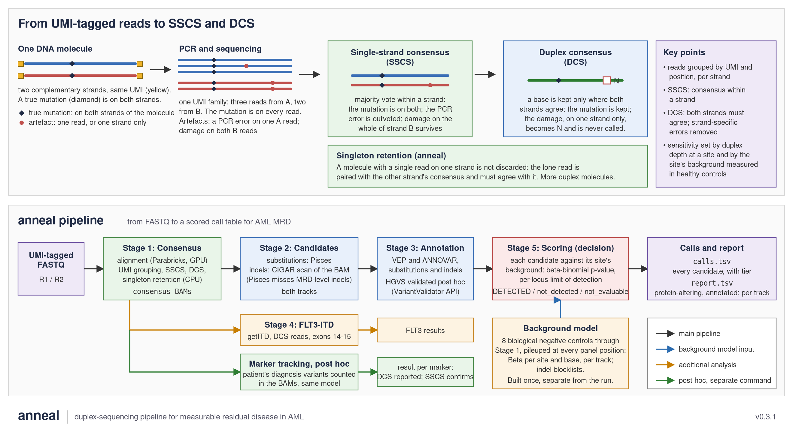

# anneal

anneal is a duplex-sequencing pipeline for measurable residual disease
(MRD) in acute myeloid leukaemia.

Duplex sequencing tags every DNA molecule with a unique molecular
identifier before amplification and reads both of its strands
independently. A base is accepted only if the two strands agree, which
removes the errors from PCR, sequencing and DNA damage that affect one
strand at a time. What can then be detected at a site is set by how many
duplex molecules cover it and by how much background that site shows in
healthy controls. anneal implements the whole of this from FASTQ to a scored
call table for the AML MRD panel: alignment, consensus construction, variant
calling, annotation, and scoring of every candidate against a per-site
background model measured on eight healthy-control libraries.



Version 0.3.1.

## Pipeline

| Stage | Script | Purpose | Runs on | Main output |
|-------|--------|---------|---------|-------------|
| 1 | `stage1_consensus.sh` | Alignment (Parabricks), UMI grouping, SSCS/DCS consensus with singleton correction | GPU, then CPU | consensus BAMs, statistics |
| 2 | `stage2_variant_calling.sh` | Substitution calling (Pisces) and a CIGAR-based indel scan | CPU | candidate VCF and indel table |
| 3 | `stage3_annotate.sh` | Annotation (VEP, ANNOVAR) | CPU | annotated tables |
| 4 | `stage4_flt3.sh` | FLT3-ITD (getITD) | CPU | FLT3 table |
| 5 | `stage5_score.sh` | Scoring against the background model; tier; report | CPU | `calls.tsv`, `report.tsv` |

Stage 5 is the decision layer. Every candidate is compared with the site-
and substitution-specific background and classified `DETECTED`,
`not_detected` or `not_evaluable`, with its p-value and per-locus limit of
detection. A `tier` column separates MRD-level calls from high-VAF,
clonal, and floor-of-evidence rows; `report.tsv` is the readable,
protein-altering subset with annotation joined. Only alignment uses the GPU;
a sample takes about 100 minutes end to end.

## Quick start

```bash
# one sample, all stages
bash pipeline/run_pipeline.sh SAMPLE R1.fastq.gz R2.fastq.gz OUTDIR --stages 1,2,3,4,5

# selected stages on existing output
bash pipeline/run_pipeline.sh SAMPLE x x OUTDIR --stages 5

# on the cluster: one sample, or a batch from a sample sheet
qsub -v FULL=SAMPLE_S1,OUT=/path/out,FQ=/path/fastq jobs/anneal_e2e.pbs
qsub -J 0-N -v MANIFEST=cohort.manifest,OUT=/path/out,FQ=/path/fastq jobs/anneal_cohort.pbs
```

All paths, tools and parameters are in `pipeline/config.sh`; the defaults
are the validated configuration and a run needs no overrides.
`SETUP_GUIDE.md` covers installation, `SOP.md` routine operation (sample
sheets, batches, reading the output, marker tracking).

## Background model

A Beta distribution per position and alternate base, per track, from the
consensus BAMs of eight biological negative controls, built from pileups so
that no site is censored by a caller. Zero-count sites are anchored by a
Jeffreys prior; a control carrying a sample-specific event at a site is
excluded for that site; between-control dispersion is estimated where the
counts support it and falls back to a conservative default where they do
not. Indel artifacts are handled by per-track recurrence blocklists. Details
in `ARCHITECTURE.md`; rebuild with `jobs/rebuild_background.pbs`.

## Reporting

**DCS is the reported track.** SSCS is confirmatory: it can show a known
marker that DCS has too few molecules for, and such a finding is reported
as "detected below duplex sensitivity" with both counts. SSCS is not
quantitative and is damage-prone for C>T/G>A near its limit.

Marker tracking runs post hoc with `scripts/error_model/call_mrd_markers.py`
on the stage 1 BAMs; for a longitudinal series the baseline candidate list is
scored on every later sample.

## Validation

At about 2,800× duplex depth the limit of detection is about 0.1% for
three molecules; 0.05% needs about 6,000×. The validation record is in
`CHANGELOG.md`.

## Current limitations

- One low-coverage probe (CEBPA) is non-evaluable at every dilution rung.
- A TP53 intronic position where controls disagree widely is effectively
  non-evaluable.
- Insertion alleles containing N (strand disagreement inside the insertion)
  are excluded at candidate build, not yet at the scanner.
- Indels have a recurrence blocklist but no per-site statistical model; a
  three-read indel absent from the controls is reported, tiered `mrd_floor`.
- Changing the consensus cutoff (0.6) or the caller's tail-position
  behaviour requires rebuilding the background model and revalidating.

## Requirements

CUDA GPU node with Parabricks through Apptainer; Rust toolchain; conda
environment `anneal` (pysam, numpy, pandas, samtools, requests); Pisces 5.2
with the .NET 8 runtime; VEP in its own environment; ANNOVAR; getITD. No
scipy. See `SETUP_GUIDE.md`.

## Repository layout

```
pipeline/            config.sh, run_pipeline.sh, stage 1-5 scripts, batch runner, report collection
src/                 Rust consensus engine
scripts/             annotation, indel scan, error_model/ (scoring, reports, blocklists, HGVS validation)
build_background.py  background model builder
jobs/                reference PBS jobs: single sample, cohort array, background rebuild, saturation
ARCHITECTURE.md      design and rationale
SOP.md               operating procedure
SETUP_GUIDE.md       installation
CHANGELOG.md         release history and validation numbers
```

## References

- Consensus construction follows ConsensusCruncher (Wang et al., Nucleic Acids Research 2019), including singleton correction.
- Background error modelling follows Waalkes et al. (Haematologica 2017), rebuilt from pileups with the estimator changes described in `ARCHITECTURE.md`.
